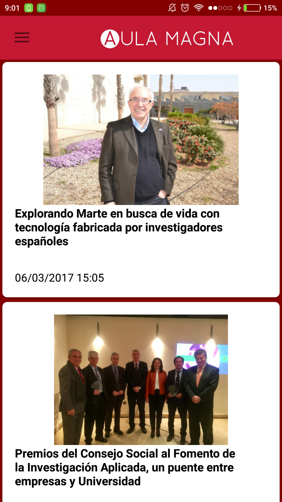
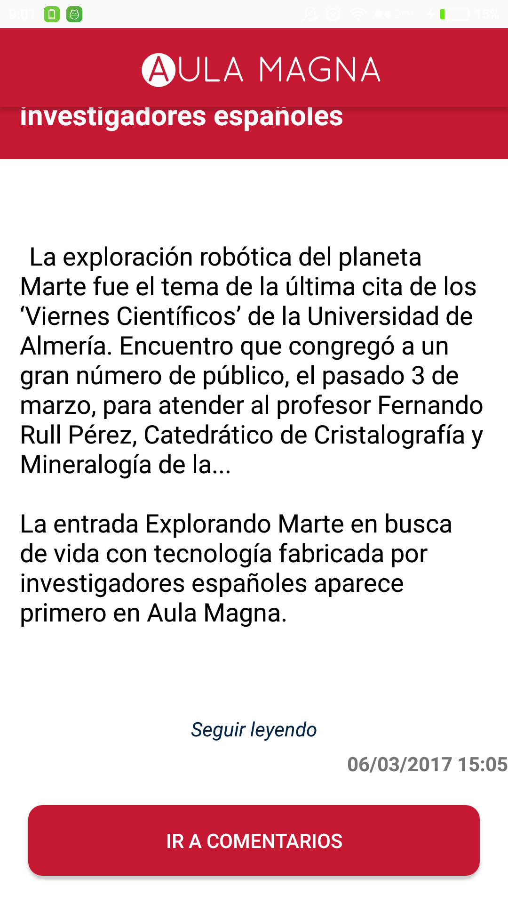
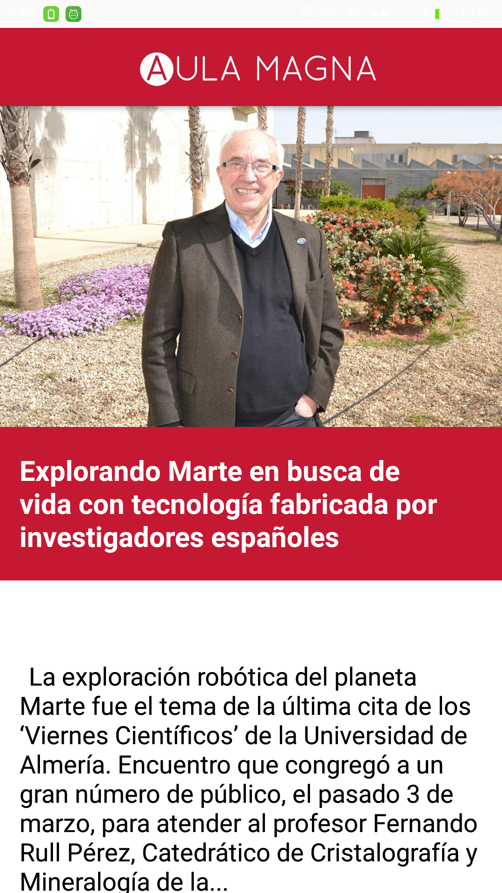
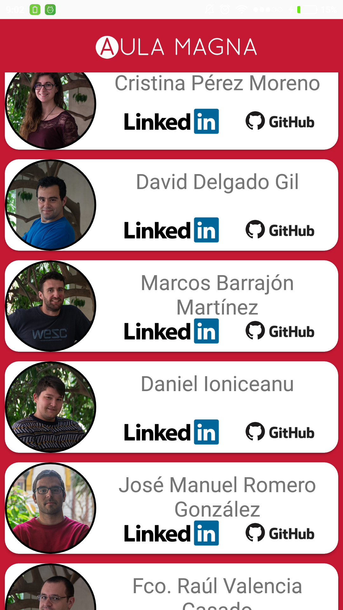
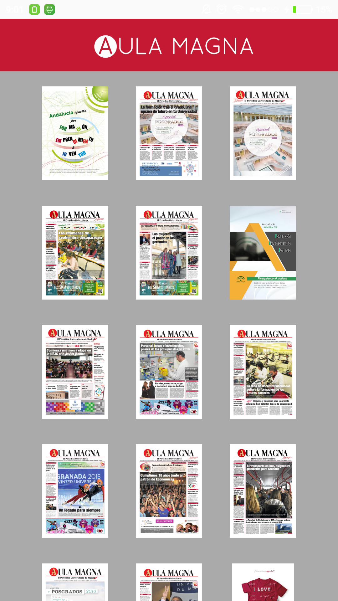

## AulaMagnaApplication
App for Aula Magna Universitary Newspaper, Málaga

## The Developer Team

[Cristina Pérez Moreno](https://github.com/pemCristina)
[David Delgado Gil](https://github.com/erdeivi)
[Diego Freniche](https://github.com/dfreniche)
[Daniel Ioniceanu](https://github.com/danielioniceanu)
[Francisco Raúl Valencia Casado](https://github.com/FRValencia)
[José Manuel Romero González](https://github.com/josemanuelromero93)
[Marcos Barrajón Martínez](https://github.com/Marquetes884)

## ¿Qué hace Aula Magna Application?

Aula Magna Application muestra las noticias del diario universitario Aula Magna, divididas por categorías, en una aplicación nativa para Android. Además permite acceder a la Hemeroteca del diario e ir a los comentarios de las noticias.

## Screenshots

 
